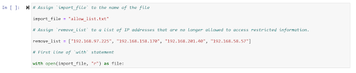
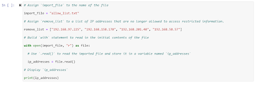
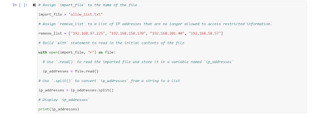
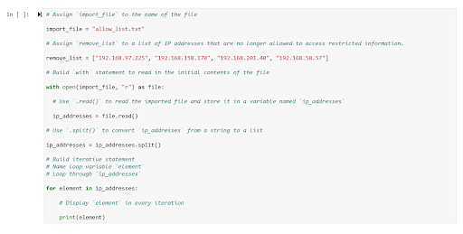
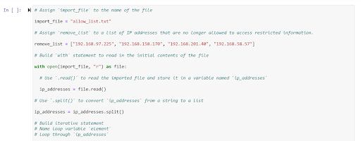
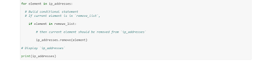
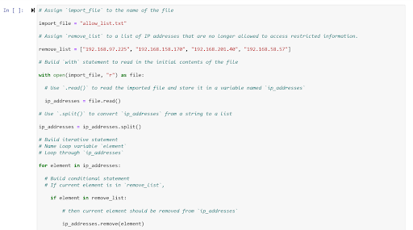
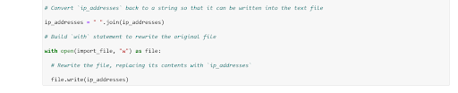

# Algorithm for file updates in Python

## Project description

In this project, I took on the role of a security professional at a healthcare company responsible for protecting access to sensitive patient records. Part of my job was maintaining an allow list of employee IP addresses that are permitted to sign into a restricted subnetwork. To keep the system secure, I also had to account for a remove list, which identifies employees who should no longer have access.

My task was to design a Python algorithm that automatically checks the allow list against the remove list. If any IP addresses appear on both lists, the program removes those entries from the allow list file. This ensures that only authorized employees can access the restricted content, while simplifying the process of keeping the access controls up to date.

## Open the file that contains the allow list

I started by assigning ‘import\_file’ to the name of the file and ‘remove\_list’ to a list of the IP addresses that are no longer allowed to have access to the restricted information. I then started a with statement to open and read through the file.

## Read the file contents

Here I read through the ip\_addresses file with the .read() method, and displayed the contents of it with a print function. 

## Convert the string into a list

Here I converted the ip\_addresses contents into a string as it was originally a string. I did so by utilizing the .split() command. 

## Iterate through the remove list

In order to iterate through the remove list, I incorporated a for loop to go through every element in the ip\_addresses list and printed each element per iteration. 

## Remove IP addresses that are on the remove list

Within my for loop meant to parse through each element in ip\_addresses, I included a conditional if statement that checks if the ip\_address is in the remove\_list variable. If this proves to be true, then it is removed from the list through the use of the .remove() method which removes an element from a list. I then printed out the contents of the list of IP addresses once the loop is over.  

## Update the file with the revised list of IP addresses 

In order to update the file, I first utilized the .join() method to convert the ‘ip\_addresses’ list back into a string. I then incorporated a with statement to rewrite the original file. Within this statement I was able to write to the file by using the write() method that serves to write to a file. 

## Summary

This project demonstrates how to strengthen security by controlling access to restricted networks. The algorithm uses Python to compare an approved list of employee IP addresses with a removal list that identifies users who should no longer have access. Any IP addresses that appear on both lists are automatically removed from the allow list. This prevents unauthorized users from accessing sensitive resources and ensures compliance with security policies. By automating this process, the company can maintain stronger protections with less manual effort in the future.   

