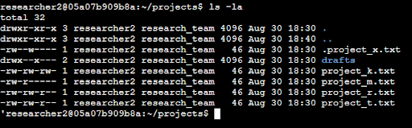
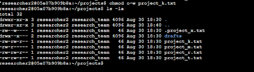
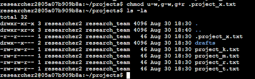
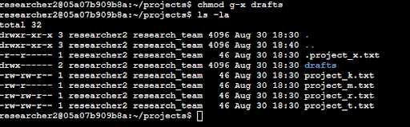

# File permissions in Linux

## Project description

The research team at my organization needs to update the file permissions for certain files and directories within the projects directory. The permissions do not currently reflect the level of authorization that should be given. Checking and updating these permissions will help keep their system secure. To complete this task, I performed the following tasks:

## Check file and directory details

The following code displays how I was able to utilize Linux commands in order to view the existing permissions set for a specific directory.  

The first line shows the command I entered, and the following lines are the output. This shows all of the contents of the projects directory. I used the ls \-la command to display a list of the file contents and return the hidden files as well. The output shows that there is one directory named drafts, a hidden file .project\_x.txt, and five other project files. The permissions set for each file are indicated by the ten character string in the first column (i.e. drwxr-xr-x).

## Describe the permissions string

By looking at the 10-character string, we can determine who is authorized to access the file and their specific permissions. 

- 1st char: Either a d or a hyphen (-) which indicates the file type. A hyphen (-) indicates it is a regular file and a d indicates it is a directory.   
- Chars 2-4: Indicate the read, write, and execute permissions for the user. When either one is a hyphen, it indicates that the user does not have the respective permission.  
- Chars 5-7: Indicate the read, write, and execute permissions for the group.  
- 8th-10th chars: Indicate the read,write, and execute permissions for other. This consists of all other users on the system other than the user and group. 

I.e. the file permissions for project\_m.txt are \-rw-r-----. The first character being a hyphen indicates that this is a regular file and not a directory. The 2nd and 5th characters are r, which means that the user and group has read permissions for the file. The 3rd character is a w, which means that the user also has write permissions. All of the other characters are hyphens(-) indicating that those permissions are not granted accordingly. In this case, other has no permissions pertaining to this file. 

## Change file permissions

The organization determined that other should not have write access to any of their files. In order to adhere to this, I looked through the previously returned file permissions and removed the write access for the project\_k.txt file for the other owner type.

This can be shown through the following Linux commands:  

The first two lines display the commands that I entered, and the other lines show the output of the second command. I used the chmod command to change the permissions on the project\_k.txt file. The first argument indicates what permissions should be changed and the second specifies the file or directory. For this example I removed the write permissions from the owner type ‘other’ for this file. I then used ls \-la again to view the updates I made. 

## Change file permissions on a hidden file

The research team at this organization recently archived project\_x.txt and do not want anyone to have write access to it, but the user and group should have read access only. 

To make the respective changes, I used the following Linux commands to change the permissions:

Again, the commands I entered are in the first two lines, and the other lines display the output of the second command. The .project\_x.txt file is a hidden file since it starts with a period (.). For this example, I removed the write permissions from the user and group and added read permissions ot the group. I removed write permissions from the user with u-w, then removed write permissions from the group with g-w. Lastly, I added read permissions to the group with g+r. 

## Change directory permissions

The organization only wants the researcher2 user to have access to the drafts directory and its contents. So, no one other than researcher2 should have execute permissions. 

I will show how I used Linux commands to change the permissions below:

This output displays the permission listing for several files and directories. Line 1 indicates the current directory (projects) and line 2 indicates the parent directory (home). Line 3 indicates a regular file titled .project\_x.txt, and line 4 is the directory (drafts) with restricted permissions. Here it is visible that only researcher2 has execute permissions. Previously it was shown that the group had execute permissions, so I changed that by utilizing the chmod command to remove them. Researcher2 already had execute permissions, so I did not need to add those. 

## Summary

For this exercise, I changed multiple permissions in order to match the level of authorization my organization wanted for files and directories in the projects directory. I first used ls \-la to check the permissions for the directory, which informed my decisions for the following steps. I then utilized the chmod command multiple times in order to add or take away permissions on files and directories where needed per the organization’s needs.   

