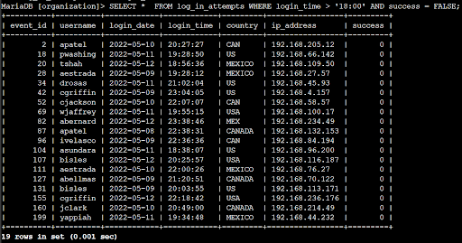
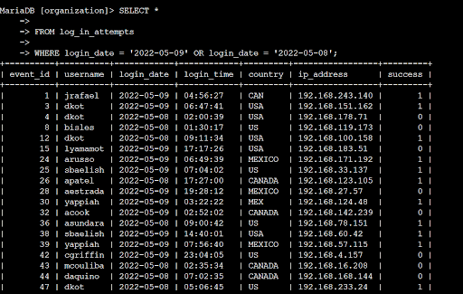
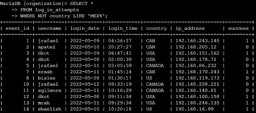
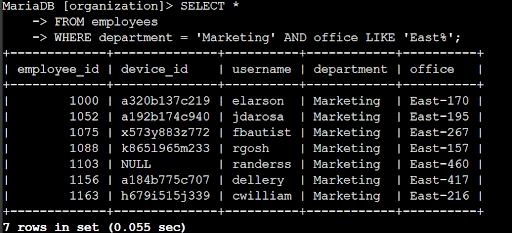
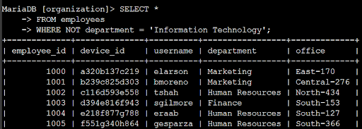

# Applying filters to SQL queries

## Project description

My organization is working to make their system more secure, and it is my job to ensure the system is safe, investigate all potential security issues, and update employee computers as needed. The following displays the steps of how I utilized SQL with filters to perform security related tasks. 

## Retrieve after hours failed login attempts

A potential security incident occurred after business hours (after 18:00). Any log in attempts after 18:00 are due to be investigated. 

The following code demonstrates the SQL query I created to filter for failed login attempts after business hours.   
+ 
The first line is my query, and the second portion (table) is the output. This query filters for failed login attempts that occurred after 18:00. I first selected all the data from the log\_in\_attempts table by using SELECT \*. I then used a WHERE clause with an AND operator to properly filter the results to output only login attempts that occurred after business hours and were unsuccessful. The first condition is login\_time \> ‘18:00’, which filters for the login attempts that occurred after 18:00, and the second condition is success \= False. The second condition filters for the failed login attempts. 

## Retrieve login attempts on specific dates

A suspicious event occurred on 2022-05-09. Any login activity that happened on that day or the day before needs to be investigated. 

The below code shows how I created a SQL query to filter for login attempts that occurred on specific dates.  
+ 
The first part of this screenshot shows my query and the second part shows a portion of the output. This returns all login attempts that occurred on 2022-05-09 or 2022-05-08. I made sure to select all data from the log\_in\_attempts table and then used a WHERE clause with an OR operator to filter my results to only output login attempts that occurred on either of the two days. TI used two conditions: login\_date \= ‘2022-05-09’ and login\_date \= ‘2022-05-08,’ which both filter logins for their respective date of the two. 

## Retrieve login attempts outside of Mexico

After looking through the organization’s available data on login attempts, there seems to be an issue with the login attempts that occurred outside of Mexico, so I investigated them by creating an SQL query to filter for login attempts that occurred outside Mexico.  
+ 
The first part contains my query and the second part is the output. This query returned all login attempts that occurred in countries other than Mexico. In order to do this, I selected all data from the table, used a WHERE clause with NOT to filter for countries other than Mexico, and used LIKE with MEX% because the dataset represents Mexico as both MEX and MEXICO (the % sign represents any number of unspecified characters when used with LIKE). 

## Retrieve employees in Marketing

My team wants to update the computers for certain employees in the Marketing department, so I have to get information on which employee machines to update. 

+ 
The first part displays my query and the second is the output. This query returns all of the employees in the Marketing department in the East building. I selected all data from the employees table and used a WHERE clause with AND to filter for employees that work in the marketing department and in the East building. I made use of the LIKE operator with East% as the pattern to match because the data in the office column represents the East building with the specific office number. My first condition is the department \= ‘Marketing’ portion which filters for employees in the marketing department, then I utilized the condition office LIKE ‘East%’, which filters for employees in the East building. 

## Retrieve employees in Finance or Sales

There are updates needed for the machines for employees in the Finance and Sales departments, so I had to get information on employees from these two departments specifically. 

I created an SQL query to filter for employee machines from employees in either the Finance or Sales departments.

+ 
The first part of this screenshot displays my query, and the second portion is again the outputted table. THis query returns all of the employees in the Finance and Sales departments. I did this by first selecting all data from the employees table, then used a WHERE clause with OR to filter for employees who are in either department. Instead of using the AND operator, I used OR because we wanted to filter for all employees who are in either department rather than in both. The first condition is department \= ‘Finance’ which filters for employees from the Finance department, and the second condition is department \= ‘Sales,’ which filters for those employees in the Sales department. 

## Retrieve all employees not in IT

My team now needs to make one more security update on employees that are specifically not in the IT department. In order to make this update I need to get information on them, which is displayed below through the creation of a SQL query to filter for employee machines form employees that are not in that department.

+ 
The first part is my query, and the second is a part of the output. This query returns all of the employees that are not in the information technology(IT) department. I first selected all data from the employees table in order to do this. Then, I utilized a WHERE clause with NOT in order to filter for employees that are not in the department (the NOT operator negates the following condition). 

## Summary

Through this project, I was able to apply SQL queries in order to get specific information on login attempts and employee machines through the use of two different tables: log\_in\_attempts and employees. I used various operators, namely the AND, OR, and NOT operators to filter for the specific information needed for each task. I also made use of the LIKE operator along with the percent symbol (%) in order to filter for patterns.  

